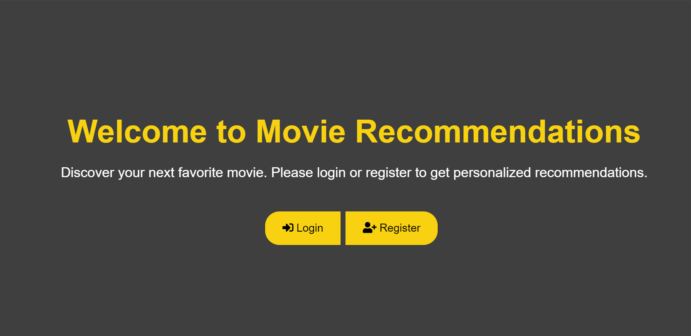

# 🎬 Movie Recommendation System Using Feedback Mechanism

Welcome to the **Movie Recommendation System**! This project delivers personalized movie recommendations using an interactive feedback mechanism. Users can 👍 like or 👎 dislike movies to refine future suggestions.

---

## 📋 Table of Contents

- [✨ Features](#-features)
- [🚀 Demo](#-demo)
- [⚡ Getting Started](#-getting-started)
- [📊 Data](#-data)
- [🕹️ Usage](#-usage)
- [🗂️ Project Structure](#-project-structure)
- [🤝 Contributing](#-contributing)
- [🪪 License](#-license)

---

## ✨ Features

- 🎯 **Personalized Recommendations:** Tailored movie suggestions based on your feedback.
- 🔄 **Feedback Mechanism:** Like or dislike movies to improve recommendations.
- 📜 **Liked/Disliked Lists:** View your liked and disliked movies separately.
- 🐳 **Docker & Compose Support:** Easy deployment with Docker.
- 📒 **Data Analysis Notebook:** Explore the Jupyter Notebook for model insight.

---

## 🚀 Demo



_Explore how the recommendation system looks and works!_

---

## ⚡ Getting Started

### 1️⃣ Clone the repository

```bash
git clone https://github.com/KarthikKankatala/Movie-RecApp.git
cd Movie-RecApp
```

### 2️⃣ Install dependencies

```bash
pip install -r requirements.txt
```

### 3️⃣ Run with Docker (Recommended 🐳)

```bash
docker compose up
```

### 4️⃣ Or Run Manually

```bash
python app.py
```

### 5️⃣ Explore the Data Notebook

Open `Projectid_74_Movie_Recommendation.ipynb` in Jupyter for data exploration and model training.

---

## 📊 Data

- `data.csv` and `movies.csv` — Contain movie and ratings data (required for recommendations).
- _Ensure these files are present in the project root._

---

## 🕹️ Usage

1. 🚦 Launch the application.
2. 🎥 Browse through the recommended movies.
3. 👍 Like or 👎 dislike movies to refine your profile.
4. 📂 Check your liked/disliked lists from the dropdown menus.

---

## 🗂️ Project Structure

```
.
├── app.py                     # Main backend application
├── create.py                  # Database/setup utility script
├── requirements.txt           # Python dependencies
├── Dockerfile, compose.yaml   # Docker configuration files
├── Projectid_74_Movie_Recommendation.ipynb  # Data analysis notebook
├── static/                    # Static assets (images, CSS, JS)
├── templates/                 # HTML templates
├── Images/                    # App screenshots and images
├── data.csv, movies.csv       # Movie datasets
```

---

## 🤝 Contributing

Contributions are welcome! Please open issues or submit pull requests.
Feel free to add new features, fix bugs, or improve documentation. 🌱

---

## 🪪 License

This project is licensed under the [MIT License](LICENSE).

---

_See the full list of project files in the [repository](https://github.com/KarthikKankatala/Movie-RecApp/tree/main/)._
